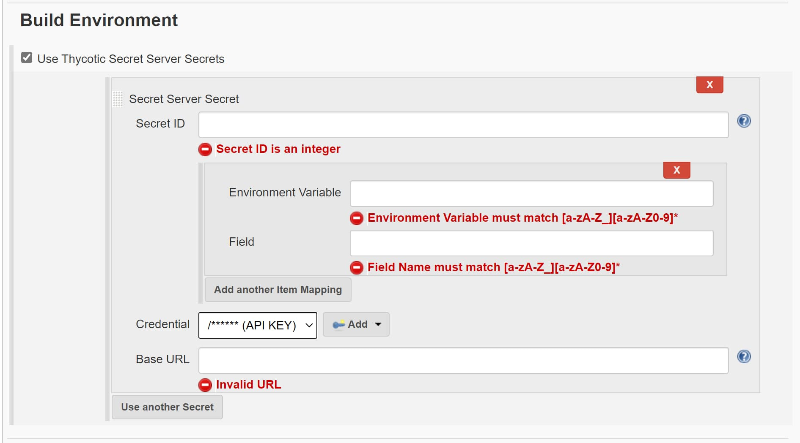
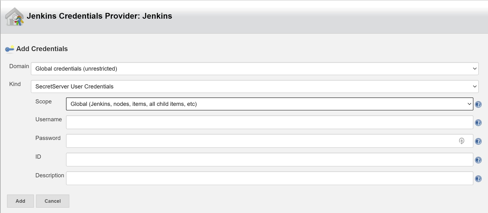

# Thycotic Secret Server

The Thycotic Secret Server Jenkins Plugin allows you to access and reference your Secret Server secrets for use in Jenkins builds.

## Usage

This plugin add the ability to include Secret Server Secrets into your build environment.

This is allows you to include the `Base URL` of you Secret Server and `Secret ID` you wish to access.

Additionally you will need to include a valid credential provider.

You will now have the option to change the `kind` of credential you wish to add, to that of a `SecretServer User Credentials`.

After you have added your credentials to the build environment you can can use the secret in your build/s.

> IMPORTANT: By default, this plugin will add a `TSS_` prefix to the environment variables. You should leave the `Environment Variable Prefix` field blank in the Jenkins UI when consuming your credential.

## Release notes

### 1.0.0

- Stable release published to Jenkins plugin repository

### 1.0-SNAPSHOT

- Initial release
